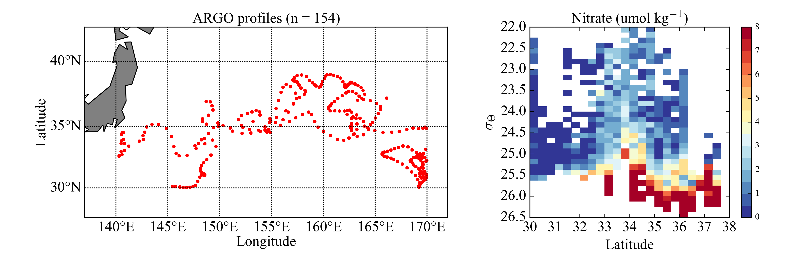

# Spatial and temporal variability in nutricline depth in the Western Pacific

This repository contains scripts used to calculate nutricline depth from BGC-Argo floats in the Western Pacific.

## Abstract
The depth of the nutricline and the magnitude of vertical nutrient fluxes have a direct influence on primary productivity and the strength of the biological carbon pump. Western boundary currents have been shown to be hotspots for carbon cycling, largely due to their high levels of eddy kinetic energy superimposed over large latitudinal gradients in physical and biogeochemical properties. The presence of mesoscale eddies and submesoscale filaments drives variability in the mixed layer and the nutricline depth over a wide range of space and time scales. The Kuroshio and Oyashio have been shown to act as large-scale subsurface nutrient streams, supporting large lateral transports of nutrients within the upper thermocline, and these nutrient streams are characterized by persistent along-isopycnal positive nitrate anomalies. However the extent of the spatial and temporal variability of the nutricline depth in the north western Pacific is not well known, partly due to the relatively sparse number of nutrient profiles over the broader region. In this study, data from a large number of continuous nitrate profiles from BGC-Argo floats deployed in the western Pacific, spanning multiple years and seasons, are used to determine temporal and spatial variability in the nutricline depth and nitrate fluxes, and how they relate to physical dynamics and primary productivity estimated from remote sensing.

An example of an aggregate analysis of nitrate data from two BGC-Argo floats in the. Kuroshio Extension, taken from Clayton et al., 2021, doi:[10.1029/2021JC017782](https://agupubs.onlinelibrary.wiley.com/doi/10.1029/2021JC017782)

## To Do
### Data:
- BGC-Argo floats (add all float numbers used here) - downloaded 1/3/22
- Satellite NPP from VGMP and CGMP algorithms

### Analysis:
- Check the data, some floats seem to have QA/QC issues with big jumps in nitrate concentrations
- Determine nutricline from individual profiles. Which criterion should be used? Look into literature on this. - simple function based on np.interp done 
- Determine density surface associated with nutricline. How does this vary across the region?
- Look into estimating epsilon and kappa from the T/S profiles
- Look into estimating nitrate fluxes using kappa (see above)

### Figures to make:
- Data density in time/space
- Example profile(s) of nitrate, epsilon and nitrate flux
- Seasonal maps of nutricline depth
- Histograms to show spatial/seasonal variability in nutricline depth and nitrate flux
- Nutricline depth vs. SSH
- Nutricline depth vs. satellite NPP
- NItrate flux vs. satellite NPP
